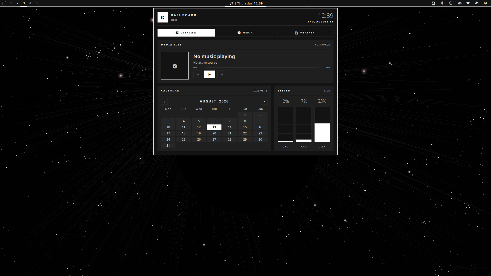

# Omi Shell

Omi Shell is a Japanese ink-inspired desktop shell for
[Quickshell](https://quickshell.outfoxxed.me/) and Hyprland. It provides a
multi-monitor top bar, application launcher, notification center, media
dashboard, system controls, appearance management, and a separate Wayland
session lock.

The project is built for a personal Arch Linux and Hyprland environment. The
core shell is modular, but some helper actions deliberately assume Arch tools,
Kitty, and a custom Hyprland Lua setup.

## Preview



## Features

- Per-monitor wallpaper layers and top bars with Hyprland workspaces.
- MPRIS media status, Cava visualization, clock, network, VPN, audio,
  notifications, system tray, system monitor, optional battery status, and
  power controls.
- Application launcher with desktop-entry search and frecency ranking.
- Launcher modes for calculator (`=`), shell commands (`>`), web search (`?`),
  and emoji search (`:`).
- Clipboard history with text and image previews, activation, and deletion.
- Notification server with toasts, history, actions, unread state, and DND.
- Media dashboard with playback, weather, calendar, and system statistics.
- PipeWire audio mixer, NetworkManager controls, volume OSD, and Polkit agent.
- Keshiki Studio for matching shell themes and wallpapers, including optional
  Matugen-generated palettes.
- Screenshot modes for smart selection, windows, workspaces, and regions.
- Multi-monitor Wayland lock screen with PAM authentication.
- Utility menu for Arch packages, AUR packages, web apps, TUI launchers,
  Bluetooth, power profiles, Hyprland keybindings, and shell configuration.

Popups are loaded on demand and coordinated so that overlapping shell surfaces
do not remain open at the same time.

## Requirements

### Core

- A Wayland session running Hyprland.
- Quickshell with Hyprland, PipeWire, MPRIS, notifications, system tray, PAM,
  Polkit, UPower, and Wayland support.
- PipeWire and NetworkManager.
- A Nerd Font for the shell icons, preferably `Symbols Nerd Font Mono`.
- Standard command-line tools such as `bash`, `curl`, `jq`, `ip`, `nmcli`, and
  `hyprctl`.

### Feature dependencies

Some features remain usable when their optional tool is missing, while others
require the corresponding command:

| Feature | Commands |
| --- | --- |
| Clipboard | `cliphist`, `wl-paste`, `wl-copy` |
| Launcher calculator | `qalc` |
| Media position control | `gdbus` |
| Audio control panel | `pavucontrol` |
| Audio visualization | `cava` (optional) |
| Battery status | UPower daemon (optional) |
| Weather | `curl` and internet access to Open-Meteo |
| Screenshot capture | `grim`, `slurp`, `wayfreeze`, `magick`, `hyprctl`, `jq` |
| Screenshot extras | `satty`, `wl-copy`, `notify-send`, `xdg-user-dir` |
| Interactive utility scripts | `fzf`, Kitty |
| Package management | `pacman`; `paru` or `yay` for AUR packages |
| Power profiles | `powerprofilesctl` |
| Bluetooth settings | `blueman-manager`, Blueberry, or KDE System Settings |

The package helpers are Arch-specific. The generated Hyprland colors and a few
system actions use `hl.config(...)` and `hl.dsp.*`, which belong to the author's
custom Lua-based Hyprland configuration rather than stock Hyprland.

## Installation

Clone the repository to the path expected by the shell:

```bash
git clone https://git.asked.hu/asked/qs.git \
  "$HOME/.config/quickshell/omi_shell"
```

Install every package used by the shell and its bundled integrations on Arch
Linux or CachyOS. The script skips packages that are already installed and uses
`paru` or `yay` for the two AUR dependencies:

```bash
cd "$HOME/.config/quickshell/omi_shell"
./install.sh
```

Make sure the helper scripts are executable:

```bash
chmod +x "$HOME/.config/quickshell/omi_shell/scripts/"*
```

Set an existing wallpaper path before the first launch:

```bash
printf '%s\n' "$HOME/Pictures/wallpapers/your-wallpaper.png" \
  > "$HOME/.config/quickshell/omi_shell/current-wallpaper"
```

Start the shell:

```bash
quickshell --path "$HOME/.config/quickshell/omi_shell/shell.qml" --daemonize
```

For Hyprland autostart, add the same command to your session configuration, for
example:

```ini
exec-once = quickshell --path ~/.config/quickshell/omi_shell/shell.qml --daemonize
```

Restart an already running instance with:

```bash
~/.config/quickshell/omi_shell/scripts/theme-refresh
```

The package installer does not enable system services or configure session
startup, PAM, SDDM, and external applications; those remain explicit system
configuration steps.

## Usage

Bar items open their related surfaces on the selected monitor. Every major
surface is also exposed through Quickshell IPC, making it straightforward to
bind shell actions in Hyprland.

The general command format is:

```bash
quickshell ipc --path ~/.config/quickshell/omi_shell/shell.qml call TARGET METHOD
```

### IPC reference

| Target | Methods |
| --- | --- |
| `menu` | `toggle`, `open`, `close` |
| `launcher` | `toggle`, `open`, `close` |
| `clipboard` | `toggle`, `open`, `close` |
| `style` | `theme`, `wallpaper`, `close` |
| `power` | `toggle`, `open`, `close` |
| `notifications` | `toggle`, `dnd`, `close` |
| `audio` | `toggle`, `open`, `close` |
| `network` | `toggle`, `open`, `close` |
| `about` | `toggle`, `open`, `close` |
| `screenshot` | `capture`, `window`, `workspace`, `region` |

Example Hyprland bindings:

```ini
$omi = quickshell ipc --path ~/.config/quickshell/omi_shell/shell.qml call

bind = SUPER, SPACE, exec, $omi launcher toggle
bind = SUPER, V, exec, $omi clipboard toggle
bind = SUPER, N, exec, $omi notifications toggle
bind = SUPER, P, exec, $omi menu toggle
bind = , PRINT, exec, $omi screenshot capture
bind = SHIFT, PRINT, exec, $omi screenshot region
```

### Lock screen

The lock screen is hosted by the main shell and activated over IPC:

```bash
quickshell ipc --path ~/.config/quickshell/omi_shell/shell.qml call lock lock
```

It creates a secure `WlSessionLock` surface on every monitor. One monitor shows
the password input and the others use an ambient view. Select the input monitor
through the shell menu or directly:

```bash
~/.config/quickshell/omi_shell/scripts/lockscreen-monitor list
~/.config/quickshell/omi_shell/scripts/lockscreen-monitor set HDMI-A-1
```

Authentication uses the PAM service named `hyprlock`. A working
`/etc/pam.d/hyprlock` configuration is therefore required before relying on the
lock screen.

### Login screen (SDDM)

`sddm/omi-ink/` is an SDDM greeter theme that reuses the lock-screen visual
language: the same ensō background, shoji shutter, seal, panel, and palette.
It adds the greeter-only controls: user picker, session picker, keyboard
layout, and the power actions.

```bash
~/.config/quickshell/omi_shell/scripts/sddm-install --preview            # test run, no root
sudo ~/.config/quickshell/omi_shell/scripts/sddm-install --default --layout
```

`scripts/sddm-theme` regenerates `theme.conf` from the active shell palette and
runs as part of the theme switch, so the greeter follows the selected theme
automatically. It writes both the repository copy and the installed one at
`/usr/share/sddm/themes/omi-ink/theme.conf`, which `sddm-install` chowns to the
installing user for exactly that purpose. Everything else in the installed
theme stays root-owned; re-run `sudo sddm-install` after changing the QML.

SDDM must be the active display manager. Arch installs that use
`plasma-login-manager` (`plasmalogin.service`) cannot use SDDM themes at all:

```bash
sudo systemctl disable plasmalogin.service
sudo systemctl enable sddm.service
```

### Greeter monitors

The greeter opens one window per output and the theme decides which one gets
the login card; the rest show the ambient view. The choice comes from
`inputScreen` in `theme.conf`, which `scripts/sddm-theme` fills in from
`lockscreen-monitor`, so the greeter and the lock screen use the same monitor.
An empty or unplugged name falls back to the primary screen, so exactly one
window always shows the card.

Do not rely on SDDM's own primary-screen notion for this: under the Wayland
greeter it follows the compositor's output order. Keyboard focus does follow
it, though, and that is not something the theme can move, so the ambient view
also accepts typing and Enter — the password can be entered from either
monitor.

For X11 greeters only (`DisplayServer=x11`), SDDM starts its own X server that
knows nothing about the compositor's layout, so outputs can land in the wrong
order or position. `scripts/sddm-layout` reads the live Hyprland layout and
writes an `Xsetup` that replays it through `xrandr`; `sddm-install --layout`
installs it as `/etc/sddm/Xsetup` behind a `[X11] DisplayCommand` drop-in.
Arch's `zz-wayland.conf` default (`DisplayServer=wayland`) makes this a no-op.

## Appearance

Keshiki Studio reads wallpapers from `$HOME/Pictures/wallpapers` and themes
from `themes/`. Selecting a scene writes the current choices and regenerates
the supported external application palettes.

### State files

| File | Purpose |
| --- | --- |
| `current-theme` | Active theme slug |
| `current-wallpaper` | Absolute path to the active wallpaper |
| `current-weather-location` | Location passed to Open-Meteo geocoding |
| `lockscreen-monitor` | Preferred monitor for password input |

Weather configuration uses the following precedence:

1. `WEATHER_LOCATION`
2. `current-weather-location`
3. `Budapest`

Set `WEATHER_COORDS=latitude,longitude` to bypass location geocoding.

### Themes

Each `themes/<slug>/theme.conf` defines six values:

```ini
NAME="Kanagawa Wave"
BACKGROUND="#1f1f28"
FOREGROUND="#dcd7ba"
ACCENT="#7e9cd8"
SURFACE="#2a2a37"
MUTED="#727169"
```

Included palettes are Catppuccin Mocha, Dynamic Matugen, Gruvbox Material,
Japanese Ink, Kanagawa Wave, Rose Pine, Sakura Blossom, and Tokyo Night.

Dynamic mode uses `matugen` and `jq` when available. It falls back to a fixed
palette if color generation fails.

Theme scripts generate:

- `kitty-theme.conf` for Kitty.
- `gtk-theme.css` for GTK 3 and GTK 4.
- `~/.config/hypr/colors.lua` for the custom Hyprland Lua configuration.
- `zen-theme.css` for Zen Browser chrome.
- A `btop` theme in the user's btop configuration.
- A Fastfetch configuration and matching Omi logo in the user's Fastfetch configuration.

These files are generated, not automatically imported by every application.
Add the relevant include or import to each application's configuration.

## Project structure

```text
omi_shell/
├── shell.qml              Main shell entry point and composition
├── LockShell.qml          Standalone lock-screen compatibility entry point
├── app/                   Popup lifecycle, coordination, and public IPC
├── core/                  Platform and shared state controllers
├── features/              Self-contained shell features and surfaces
├── ui/                    Reusable feature-independent QML components
├── scripts/               External system and theme helpers
├── sddm/                  SDDM greeter theme matching the lock screen
├── themes/                Declarative color palettes
└── assets/                Static visual assets
```

The intended dependency direction is:

```text
shell.qml -> app, core, features
features  -> core, ui
core      -> Quickshell and system services
ui        -> QtQuick
```

See [`layout.md`](layout.md) for the detailed architecture and migration notes.

## Development

Run QML static checks from the repository root:

```bash
qmllint shell.qml LockShell.qml app/*.qml core/*.qml ui/*.qml features/*/*.qml
```

Validate shell scripts when ShellCheck is installed:

```bash
shellcheck scripts/*
```

The shell has not yet been covered by an automated integration test in a
nested Wayland session. Test changes on a non-critical session before using the
lock screen or power actions as daily-driver controls.
